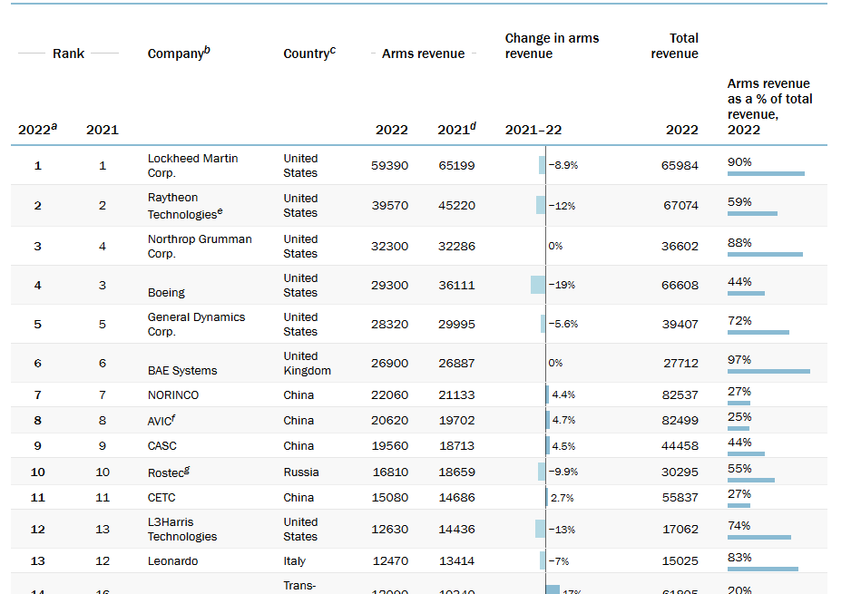
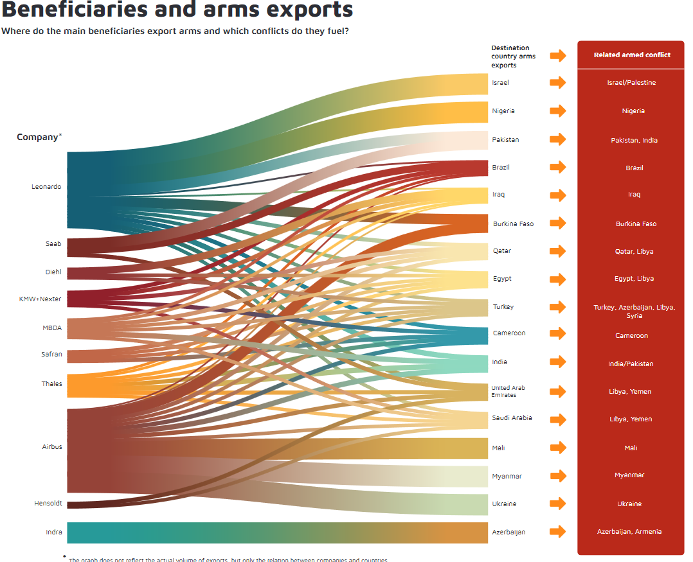
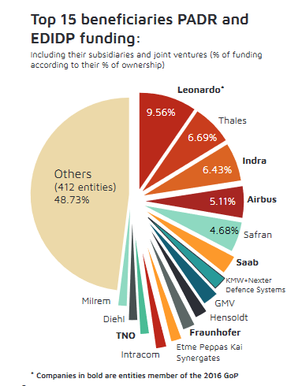
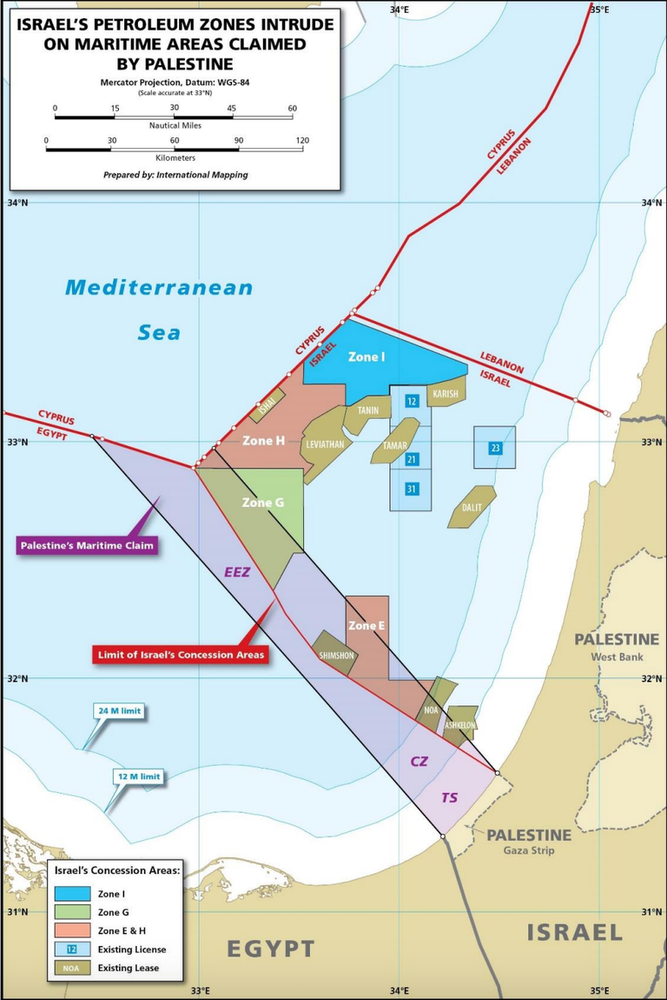

# LEONARDO:

https://www.recommon.org/non-solo-fossili-intesa-sanpaolo-pesantemente-coinvolta-nel-business-delle-armi/

https://investigate.afsc.org/company/leonardo

TLDR:
* Leonardo 1° nella UE, 13esima al mondo per ricavi. 83% dei ricavi sono dovuti a vendita di armi. [Fonte: STOCKHOLM INTERNATIONAL PEACE RESEARCH INSTITUTE, 2022]

* L. 1° beneficiaria dei fondi di R&D della UE [Rete europea per il commercio delle armi]

* L. ha un legame a doppio filo con la città di Torino e dintorni:
    * Nel 2022 Intesa Sanpaolo vi ha destinato 2/3 dei finanziamenti per il settore difesa/arospazio.
    * Torino, Caselle e Cameri sono sede di siti per assemblaggio finale e collaudo degli F35

## RAPPORTI CON ISRAELE:

* Vende alla Marina Israeliana 
* Cannone 76/62 Super Rapid MF con [proiettili guidati](https://it.wikipedia.org/wiki/Vulcano_(munizione)), 120 colpi al minuto, testate per la [prima volta proprio vs Gaza](https://www.unita.it/2024/01/16/leonardo-spa-e-i-cannoni-oto-melara-76-62-usati-contro-gaza-papa-francesco-rifiuta-donazione-al-bambin-gesu-da-15-milioni/)
* Con Elbit Systems, 2^ produttore di armi in Israele, coopera per lo sviluppo del [Joint Effects Targeting System II](https://www.leonardodrs.com/what-we-do/products-and-services/joint-effects-targeting-system-jets/), un sistema di ricognizione e puntamento laser interfacciabile con altri sistemi digitali (IA compresa) (9) (10)
* E' da giugno '22 fusa con RADA electronic industries, azienda che sviluppa l'Iron Dome (11)
* Vende elicotteri alle IDF prodotti nei suoi stabilimenti americani (12)

# CISCO:
tbd

# ENI:
Fonti:
https://radioblackout.org/2024/02/eni-licenze-israeliane-per-saccheggiare-il-gas-palestinese/

https://www.lifegate.it/eni-gas-gaza

https://www.reuters.com/business/energy/israel-awards-gas-exploration-licences-eni-bp-four-others-2023-10-29/

https://www.ilfattoquotidiano.it/2024/02/08/avviso-legale-ad-eni-illegittima-la-concessione-israeliana-per-il-gas-di-gaza-i-ricorrenti-rischio-di-complicita-in-crimini-di-guerra/7439279/ [capire i dettagli dell'avviso legale]
* Premessa: alla convenzione Onu per il diritto del mare del 1982 (UNCLOS) ha aderito la Palestina, ma non Israele.

* Israele NON RISPETTA la ZEE Palestinese, privando sfacciatamente i palestinesi della propria sicurezza energetica.

* ENI ["vince"](https://www.lifegate.it/eni-gas-gaza) (vedi paragrafo "Eni ha vinto la gara nell’ottobre 2023" oppure https://www.youtube.com/watch?v=1qngyYiGM48&t=410s) la concessione per l'esplorazione di una enorme area che si presume essere tra le più ricche di gas di tutto il Mediterraneo.
* il 62% ricade nella ZEE palestinese
* Eni pagherà le royalties a Israele
* La durata della licenza esplorativa potrà durare dai 3 ai 7 anni
* L'accordo pare non sia stato ancora siglato (?)

Varie & placeholder miei:

https://afsc.org/gaza-genocide-companies

https://www.whoprofits.org/companies/find?Text=&Name=&Category=&Sector=&Headquarter=7&Revenue=&Traded=&Presence=&Settlement=&Type=Table

https://www.ilpost.it/2024/04/10/chi-vende-le-armi-a-israele/